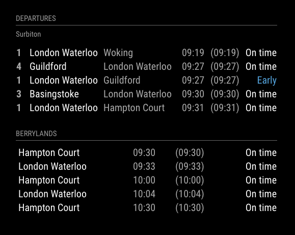

# MMM-UKNationalRail
Additional Module for MagicMirror²  https://github.com/MichMich/MagicMirror

**Please note** - I no longer run a MagicMirror, so this module is no-longer supported. Feel free to fork and update as necessary.

# Module: UKNationalRail
This module displays LIVE train departures from the specified station(s).


## Using the module

Git clone from this repository into the modules sub-directory of the Magic Mirror installation, change directory into the newly cloned code and then run npm install.

```bash
git clone https://github.com/nwootton/MMM-UKNationalRail.git
cd MMM-UKNationalRail
npm install
```
To use this module, add it to the modules array in the `config/config.js` file:

```javascript
modules: [
    {
		module: 		'MMM-UKNationalRail',
		position: 		'bottom_left',
		header:			'Departures',		//Optional - delete this line to turn OFF the header completely
		config: {
			stationCode: 		'SUR', 		// CRS code for station
			app_id: 			'', 		// TransportAPI App ID
			app_key: 			'', 		// TransportAPI App Key
			maxResults: 		5,  		//Optional - Maximum results to display.
			showOrigin: 		false   	//Optional - Show the origin of the train in the table
		}
	},
]
```
There are 3 MANDATORY fields - `stationCode`, `app_id` and `app_key`. All the others are used to limit the amount of info you get back, especially useful for busy stations like Clapham Junction.

**PLEASE NOTE** The TransportAPI provides a sample key in their documentation that I previously referenced here. This is being removed very soon, so you *MUST* register to get this module to work!

The following is taken from the TransportAPI documentation [here](https://developer.transportapi.com/docs?raml=https://transportapi.com/v3/raml/transportapi.raml##uk_train_station_station_code_live_json)

|Option|Required Settings Description|
|---|---|
|`stationCode`|String. The station you require information about. <br />This defaults to using the CRS format, but you can also specify the tiploc format by preceeding the code with 'tiploc:'<br><br>This value is **REQUIRED** <br/>**Example**: SUR <br /> **Example**: tiploc:GUILDFD <br/>|
|`api_id`|String. Your TransportAPI app_id [Get yours here](https://developer.transportapi.com/signup).<br><br>This value is **REQUIRED**  <br/>**Example**: 03zf7118 <br />|
|`app_key`|String. Your TransportAPI app_key [Get yours here](https://developer.transportapi.com/signup).<br><br>This value is **REQUIRED** <br/>**Example**: z9307fd87b0000c107e098d5effedc97 <br />|

|Option|Optional Settings Description|
|---|---|
|`called_at`|String. Only include services that call at the given station, before calling at the station of interest.<br>*It appears that you can't mix `called_at` with `calling_at` as it returns an empty response.* <br/><br>**Example:** 'THD'|
|`calling_at`|String. Only include services that call at the given station, after calling at the station of interest.<br>*It appears that you can't mix `calling_at` with `called_at` as it returns an empty response.* <br/><br>**Example:** 'EAD'|
|`darwin`|Boolean. Additionally use data from the National Rail Enquiries Darwin Data Feeds when determining the value of the status fields for all the departures, arrivals or passes.<br><br>**Default:** false|
|`destination`|String. Only include services terminating at the given station.<br><br>**Example:** 'WAT'|
|`from_offset`|String. Modifies the start of the time window for which services are retrieved. By default, this is one hour in the past relative to the date/time of interest..<br><br>**Default:** '-PT01:00:00'|
|`operator`|String. Only include services that are operated by the given operator, specified using its ATOC code<br><br>**Example:** 'SW'|
|`origin`|String. Only include services originating from the given station.<br><br>**Example:** 'HMC'|
|`service`|String. Only include services that have the given service code.<br><br>**Example:** '24673205'|
|`to_offset`|String. Modifies the end of the time window for which services are retrieved. By default, this is two hours in the future relative to the date/time of interest.<br><br>**Default:** 'PT02:00:00'|
|`train_status`|String. Only include services having the specified train status. Can be used to show either 'passenger' or 'freight' services.<br><br>**Default:** 'passenger'|
|`type`|String. Only include services of the given type. Allowed types are "arrival", "departure" or "pass". <br />These individual values can be combined using a comma separated list of the allowed types such as: <br />"arrival,departure,pass" or "pass,departure".<br><br>**Default:** 'departure'|

|Option|Other Settings|
|---|---|
|`maxResults `|Integer. Limits the number of rows returned by the module. This will be the highest number between this value or the number of rows returned if it is less.<br><br>**Default:** 5|
|`showOrigin `|Boolean. This shows the origin of the train in the results grid.<br><br>**Default:** false|
|`showPlatform `|Boolean. This shows the platform number of the train in the results grid. If no platform is specified it will show '-'<br><br>**Default:** true|


To find the CRS Station codes for the 'stations of interest' go here: http://www.railwaycodes.org.uk/crs/CRS0.shtm

## Transport API

To setup an account for the App_id & app_key sign up for an account here: http://www.transportapi.com/

## Troubleshooting

If there are issue getting data out of the module I'm ALWAYS going to ask the following:

1. Do you have an account set up at Transportapi.com?
2. Do you have an app_id and app_key set up?
3. Do you know the CRS code for the station?
4. If you use the live api documentation [here](https://developer.transportapi.com/docs?raml=https://transportapi.com/v3/raml/transportapi.raml##uk_train_station_station_code_live_json) and put in the info you want to use does it respond without an error?
5. Is the info in your config the same as that you’ve used successfully in the live api docs?
6. Include the Station CRS code in the report - each operator supplies information slightly differently. While TransportAPI does catch most of these, I might not have.
